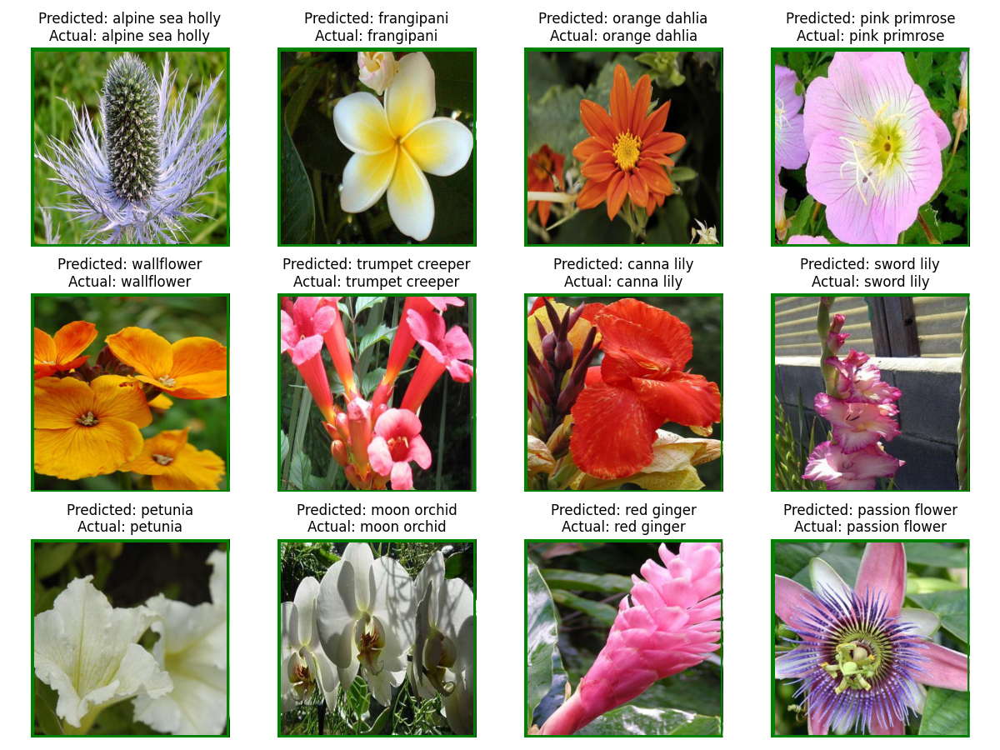

# SC4001 Project

Implementation of ViT-based FGVC on Oxford Flowers dataset.

The following changes have been implemented:
- Batch-hard triplet loss (see loss.py and train/) [TASK 4]
- Multi-scale gaussian filter in MHV within IELT, in all blocks {1 .. L-1}, using dilated conv [TASK 1]
- Mixup (made it worse, maybe it is not implemented right) [TASK 3]


The following works are in progress:
- DINOv2 self-supervised backbone ViT (TODO: layerscale, fix norm, patch emb) [TASK 1]

Disambiguation: It is not clear whether we need to use the validation set at all. The other works just directly evaluate on test set and seemingly never use it.. So I just follow those works.



# Usage

Run `bootstrap.py` to create the dataset and label files.<br>
Model can be trained with `train.py` in the `train/` folder. It is important to define MAX_GRAD_ACCUM_SUB_BATCH which divisble by 3 (for triplet loss) and is used to accumulate gradients (e.g. 32 batch size takes >32 GB VRAM on V100) <br>
The config location is set in `setup.py`. The config file should contain all non-default settings.<br>

In `test/`,<br>
Evaluate the model performance with `test.py`. Load from bin or pth ckpt.<br>
Draw the diagram of example classifications with `test_img.py`.<br>


# Experiment Results

ViT-B-16 (ImageNet-21k)
<br>
| Backbone | Loss         | Augmentation         | Misc.                | Test Accuracy (%) |
|----------|--------------|----------------------|----------------------|-------------------|
| ViT-B_16 | CE           | RandomHorizontalFlip |                      | 99.351 (16)       |
| ViT-B_16 | CE + Triplet | RandomHorizontalFlip | Multi-Scale Gaussian | 99.401 (12)       |
|          |              |                      |                      |                   |


# Citations
```latex
@ARTICLE{10042971,
  author={Xu, Qin and Wang, Jiahui and Jiang, Bo and Luo, Bin},
  journal={IEEE Transactions on Multimedia}, 
  title={Fine-Grained Visual Classification Via Internal Ensemble Learning Transformer}, 
  year={2023},
  volume={},
  number={},
  pages={1-14},
  doi={10.1109/TMM.2023.3244340}}
  
@article{oquab2023dinov2,
  title={DINOv2: Learning Robust Visual Features without Supervision},
  author={Oquab, Maxime and Darcet, Timothée and Moutakanni, Theo and Vo, Huy V. and Szafraniec, Marc and Khalidov, Vasil and Fernandez, Pierre and Haziza, Daniel and Massa, Francisco and El-Nouby, Alaaeldin and Howes, Russell and Huang, Po-Yao and Xu, Hu and Sharma, Vasu and Li, Shang-Wen and Galuba, Wojciech and Rabbat, Mike and Assran, Mido and Ballas, Nicolas and Synnaeve, Gabriel and Misra, Ishan and Jegou, Herve and Mairal, Julien and Labatut, Patrick and Joulin, Armand and Bojanowski, Piotr},
  journal={arXiv preprint arXiv:2304.07193},
  year={2023},
  archivePrefix={arXiv},
  eprint={2304.07193}
}
```